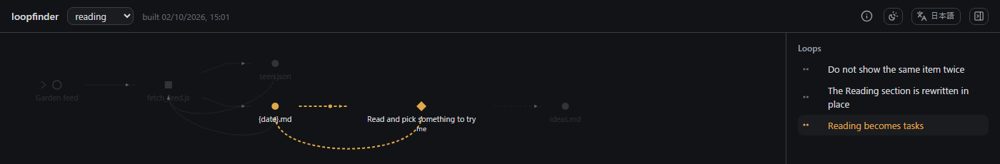
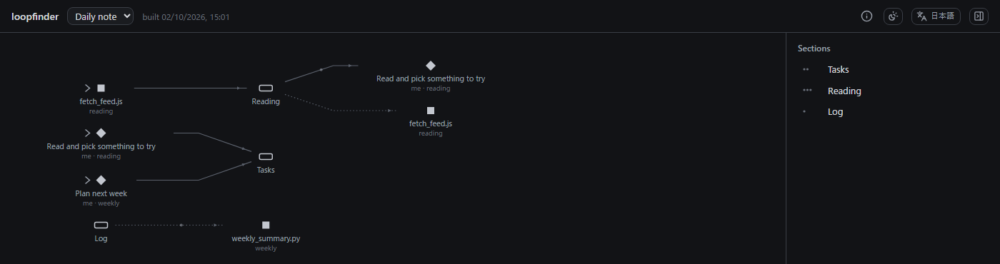

# loopfinder

[日本語](README.ja.md)

[](https://ko-fi.com/motimotinotch)

**Find the feedback loops in your personal workspace — including the ones you never meant to build.**

A notes vault with a few scripts, an AI assistant and your own habits is a system: a script writes a note,
you read it and decide something, the decision lands in another note that the script reads tomorrow.
Some of those loops you designed. Others just happened.

loopfinder draws that system and lists every loop in it:

1. **Your AI agent surveys the workspace.** loopfinder has no AI built in. It writes a guide,
   `loopfinder/AGENTS.md`; you ask the agent you already use (Claude Code, Codex, Cursor, ...) to read
   it and survey. The agent writes what it found to `loopfinder/flows.json`: which scripts to run, and
   the steps no code shows — what you do, what an AI assistant does. Your own notes are not touched.
2. **It runs the scripts and records what they touch** — reads, writes, fetches, subprocesses —
   with writes blocked, so nothing on disk changes.
3. **It counts every simple cycle, gives each one the name you declared, and reports the rest**:
   an *unnamed loop* is feedback you did not declare; a *missing loop* is one you declared that is no
   longer there (a step changed and the loop broke).



## Safety: what tracing does and does not do

Tracing **really runs your scripts**. The trace hooks (`trace/trace.js` for Node, `trace/trace.py` for
Python) replace the I/O functions before your script starts:

- **Writes are recorded and dropped.** Every fs write API in Node (sync, callback, promise, stream,
  `open` for writing) and in Python (`open`/`io.open` — so `pathlib` too — `os.open`, rename, remove,
  rmdir, truncate, link, chmod, `shutil` move/copy/rmtree; SQLite is opened read-only).
- **Network and subprocesses are blocked by default.** The attempt is recorded, then the call fails,
  so your script sees an error. Pass `--allow-network` / `--allow-subprocess` to let them through
  (they are still recorded).
- **It is a recorder, not a sandbox.** Native extensions, worker threads, or anything that bypasses
  these modules are not covered. Do not trace code you would not run.

The tests (`npm test`) try every write path above against a scratch folder and check that it is
byte-for-byte unchanged — and, as a control, that the same scripts do change it without the hook.

## Quick start

Requires Node 18+ (and Python 3 if you trace Python scripts). No dependencies.

```sh
git clone https://github.com/MotimotiNotch/loopfinder
cd loopfinder
npm run demo                 # builds the demo workspace and opens http://127.0.0.1:7878/
```

For your own workspace:

```sh
cd /path/to/your/vault
node /path/to/loopfinder/bin/loopfinder.js init     # makes loopfinder/ (config.json, flows.json, AGENTS.md)
```

Then ask your AI agent:

> Read loopfinder/AGENTS.md and survey this workspace.

It writes `loopfinder/flows.json`, and asks you before naming any loop. Then:

```sh
node /path/to/loopfinder/bin/loopfinder.js build
node /path/to/loopfinder/bin/loopfinder.js serve
```

`build` prints the loops it found, the unnamed ones, and the declared ones it could not find. Hand the
unnamed ones back to the agent: it asks you which are intended and names them. To survey again after
your routines change, ask again; the agent starts from the files each flow was learned from.

Everything loopfinder keeps is in two folders: `loopfinder/` (the flows and the config — worth keeping
in version control) and `.loopfinder/` (the build output, which lists your file paths — keep it out).
`AGENTS.md` is rewritten on every run so it follows the installed version; edit it and the edit is lost.
The viewer listens on `127.0.0.1` only: the graph lists your file paths. It can switch between English and Japanese and between auto (follow the system), light and dark; both choices are remembered by the browser.

## flows.json

The agent writes it; you read it (and can correct it). The full rules the agent follows are in the
guide, [`src/agents-guide.md`](src/agents-guide.md).

```json
{
  "flows": [
    {
      "name": "reading",
      "about": "A script collects new items into the daily note; I pick what to try.",
      "sources": ["scripts/fetch_feed.js"],
      "trace": ["scripts/fetch_feed.js 2026-10-02"],
      "start": ["web:example.com"],
      "edges": [
        "notes/daily/{date}.md#Reading -> [me] Read and pick something to try",
        "[me] Read and pick something to try -> notes/daily/{date}.md#Tasks"
      ],
      "loops": [
        { "name": "Do not show the same item twice", "nodes": ["scripts/fetch_feed.js", "scripts/seen.json"] },
        { "name": "Reading becomes tasks", "nodes": ["notes/daily/{date}.md", "[me] Read and pick something to try"], "contains": true }
      ]
    }
  ]
}
```

| Key | Meaning |
|---|---|
| `trace` | Scripts (with arguments) to run under the trace hook |
| `edges` | `A -> B -> C`: data flows from A to B, then to C |
| `[who] What` | A step done by hand. `who` is matched against `actors` in the config (you: filled, AI: hollow, anyone else: dashed) |
| `note.md#Heading` | A section of a note (used by section hubs) |
| `groups` | `{ "name", "nodes" }`: draw these in one frame |
| `loops` | `{ "name", "nodes" }` names the cycle made of exactly these nodes; with `"contains": true`, every otherwise-unnamed cycle through them |
| `start` | Where to start reading the diagram |
| `about`, `sources` | What the flow is for, and the files it was learned from (for the next survey) |

References: a path relative to the root (`notes/ideas.md`, folders end with `/`), `script:<name>`
(looked up in `scriptDirs`), `web:<name>`, `repo:<name>[/path]`, `~/path`, or an absolute path.
Dates in paths become `{date}`, ISO weeks `{week}` (configurable).

Names are matched in order: exact names before `contains` ones, and within each kind the first
declared wins.

If you would rather keep a flow next to the routine it describes, the same lines also work as a
` ```flow <name> ` block in any file listed in `declarations` (`trace: ...`, `start: ...`, `A -> B`,
`group <name>: A, B`, `loop <name>: A, B`, `loop <name> (contains): A, B`).

## Config (`loopfinder/config.json`)

Paths are relative to the workspace (the folder that holds `loopfinder/`).

| Key | Default | |
|---|---|---|
| `root` | `.` | The workspace. Files under it get root-relative ids |
| `flows` | `loopfinder/flows.json` | The flows written by your agent |
| `declarations` | `[]` | Optional: globs (relative to root) of files that hold ` ```flow ` blocks |
| `scriptDirs` | `["scripts"]` | Where `script:<name>` is looked up |
| `repos` | — | A folder of repositories, for `repo:<name>` |
| `actors` | `{"human":["me"],"ai":["AI"]}` | Who counts as you / as an AI in `[who]` |
| `webLabels` | `[]` | `[{ "match": "<regex>", "label": "..." }]` names for URLs |
| `placeholders` | dates, weeks | `[{ "pattern": "<regex>", "name": "{date}" }]` |
| `scanThreshold` | `12` | A script that only reads more files than this is folded into one "scan" node |
| `hubs` | `[]` | Hub views (below) |
| `checks` | `[]` | Modules run after a build (below) |
| `output`, `cache` | `.loopfinder/` | Where the graph and the trace records go |
| `lang` | `en` | Default UI language (`en` or `ja`); the viewer can switch |

### Hubs

A hub view puts one kind of thing in the middle and gathers, from every flow, what writes to it and
what reads it.

```json
{ "type": "sections", "name": "Daily note", "note": "notes/daily/{date}.md", "dir": "notes/daily", "level": 2 }
{ "type": "match", "name": "Content", "match": "^web:store\\((.+)\\)$", "flows": ["content"] }
```

`sections` uses the headings of a note. Which heading a step touches comes from the most reliable
evidence available: a recorded write (the hook diffs the blocked write by heading), then a declared
`note.md#Heading`, then a guess (the heading text appears in the script's code), drawn dotted.



### Checks

Workspace-specific rules run after each build:

```js
// checks/every-page-declared.js
module.exports = ({ config, graph }) => ({
  title: 'Every page is declared',
  warnings: [/* strings */],
});
```

## Prior art

- [Automation Graph](https://www.obsidianstats.com/plugins/automation-graph) (Obsidian plugin) draws a
  repository's automation from its workflow files and shows declared external automation as dashed,
  "not verifiable from this repository" nodes. loopfinder shares that split between what can be
  verified and what is only declared; it differs by running the scripts instead of reading them, and
  by counting and naming loops.
- [putior](https://cran.r-project.org/package=putior) builds workflow diagrams from `#put` annotations
  in R/Python scripts (static, no loops).
- [Neoloopy](https://forum.obsidian.md/t/neoloopy-think-in-feedback-loops-a-systems-thinking-tool-in-your-vault/115448)
  finds reinforcing and balancing loops in causal-loop diagrams you draw by hand.
- strace and [monkeyfs](https://pypi.org/project/monkeyfs/) intercept file I/O; loopfinder's Python hook
  uses the same monkey-patching approach.

Layout by [dagre](https://github.com/dagrejs/dagre) (MIT, see `LICENSE-dagre`). Icons from [Lucide](https://lucide.dev), vendored unmodified by `scripts/gen-icons.js` (ISC; `moon` and `info` derive from Feather, MIT; see `LICENSE-lucide`).

## Support

loopfinder is free. If it found a loop you did not know you had, a tip via
[Ko-fi](https://ko-fi.com/motimotinotch) is appreciated. Maintenance is best-effort.

## License

MIT
